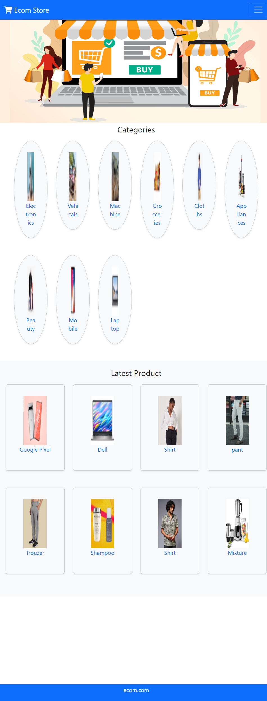
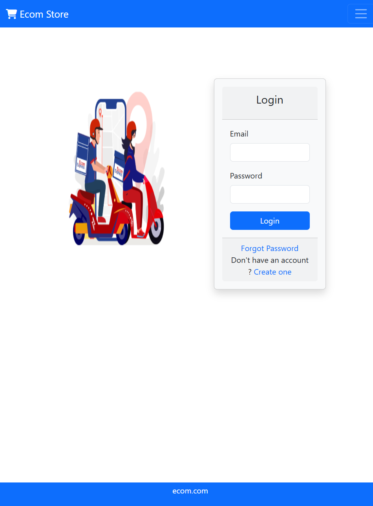
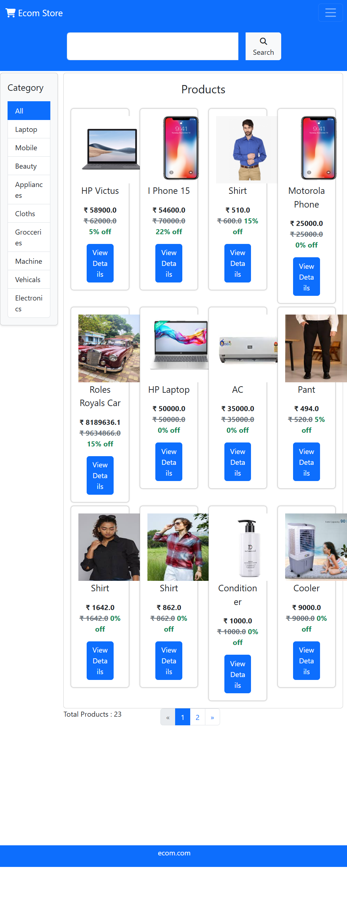
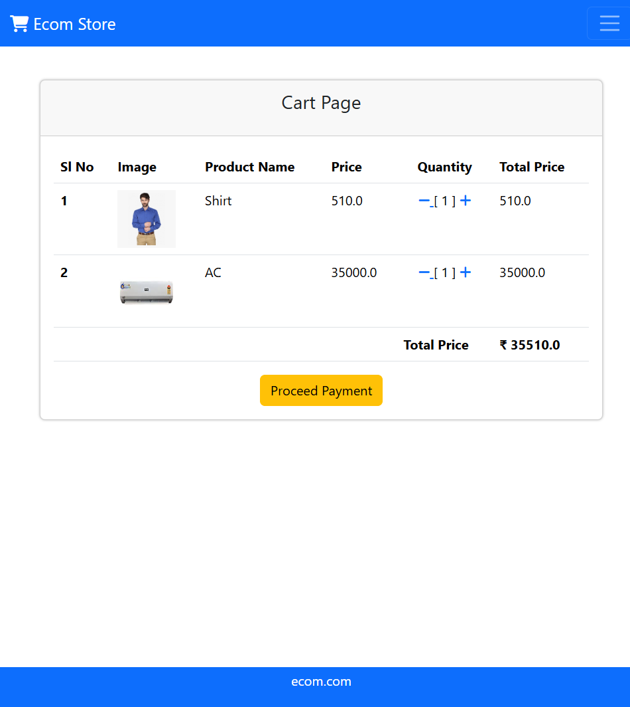
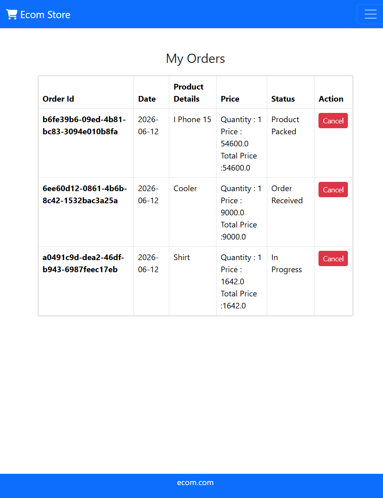
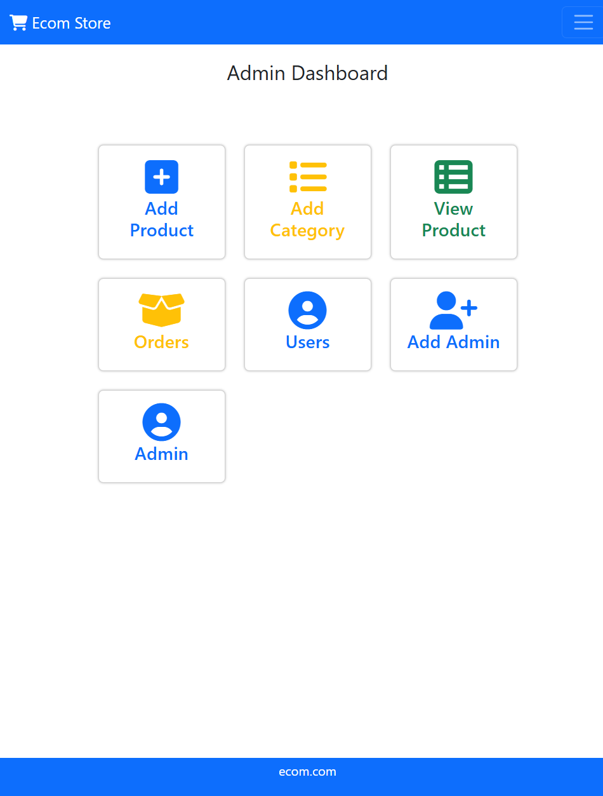
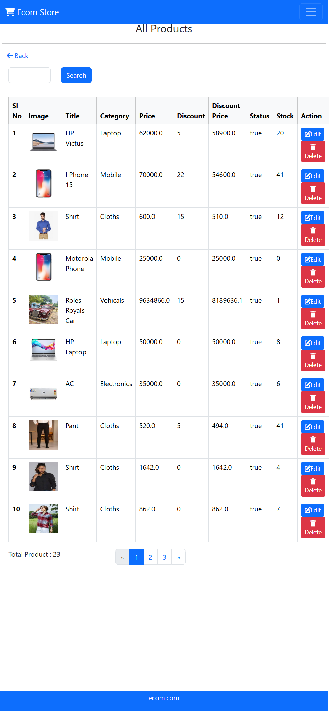
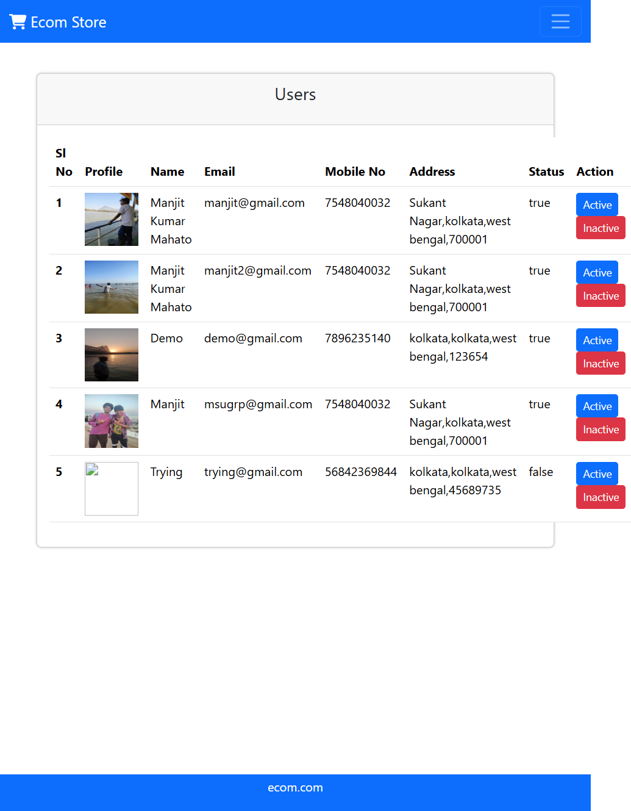
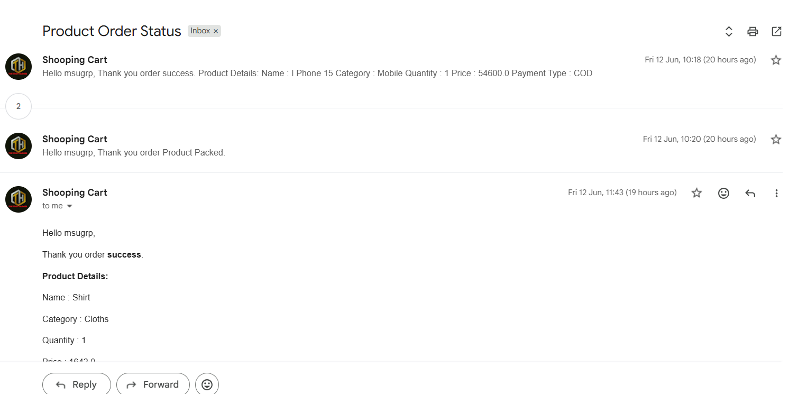

# 🛒 Spring Boot E-Commerce Application

A full-stack E-Commerce web application built using **Spring Boot**, **Spring Security**, **Thymeleaf**, **Hibernate**, and **MySQL**. The application provides a seamless shopping experience for users along with a powerful admin panel for managing products, categories, orders, and users.

---

## 🚀 Features

### 👤 User Features
- User Registration & Login
- Secure Authentication and Authorization
- Browse Products by Categories
- Pagination for Better Product Navigation
- Add Products to Cart
- Place Orders
- View Order History
- Profile Management
- Forgot Password via Email

### 🛠️ Admin Features
- Admin Dashboard
- Manage Products (Add, Update, Delete)
- Pagination for Better Product Navigation
- Manage Categories
- View and Manage Orders
- Manage Users
- Create New Admin Accounts

---

## 🏗️ Tech Stack

| Category | Technologies |
|-----------|---------------|
| Backend | Java, Spring Boot |
| Security | Spring Security |
| Frontend | Thymeleaf, HTML, CSS, Bootstrap, JavaScript |
| Database | MySQL |
| ORM | Spring Data JPA, Hibernate |
| Build Tool | Maven |
| Email Service | JavaMail Sender |

---

## 📸 Application Screenshots

### 🏠 Home Page


### 🔐 Login Page


### 🛍️ Product Listing


### 🛒 Shopping Cart


### 📦 My Orders


### 👨‍💼 Admin Dashboard


### 📋 Product Management


### 👥 User Management


### 📧 Order Status Email Notification


---

## ⚙️ Installation & Setup

### Clone the Repository

```bash
git clone https://github.com/Manjit-Kumar-Mahato/Springboot-ecommerce-app.git
cd Springboot-ecommerce-app
```

### Configure Database

Update the `application.properties` file:

```properties
spring.datasource.url=jdbc:mysql://localhost:3306/ecommerce_db
spring.datasource.username=YOUR_USERNAME
spring.datasource.password=YOUR_PASSWORD
```

### Configure Email (Optional)

```properties
spring.mail.username=YOUR_EMAIL
spring.mail.password=YOUR_APP_PASSWORD
```

### Run the Application

```bash
mvn spring-boot:run
```

Visit:

```
http://localhost:8080
```

---

## 📂 Project Structure

```
src
├── main
│   ├── java/com/ecom
│   │   ├── controller
│   │   ├── service
│   │   ├── repository
│   │   ├── model
│   │   └── config
│   └── resources
│       ├── static
│       └── templates
└── test
```

---

##🎯 Key Highlights

-Secure role-based authentication and authorization
-Search and filter products efficiently
-Pagination support for optimized browsing experience
-Email notifications for order status updates
-Responsive user and admin interfaces
-Complete order lifecycle management
-Clean layered architecture following Spring Boot best practices 

## 🔮 Future Enhancements

- Online Payment Gateway Integration
- REST API Integration
- Product Reviews and Ratings
- Wishlist Functionality
- Docker Support
- Deployment on AWS

---

## 👨‍💻 Author

**Manjit Kumar Mahato**

- LinkedIn: www.linkedin.com/in/manjit-mahato-a92578338
- GitHub: https://github.com/Manjit-Kumar-Mahato

---

⭐ If you found this project useful, consider giving it a star! 
